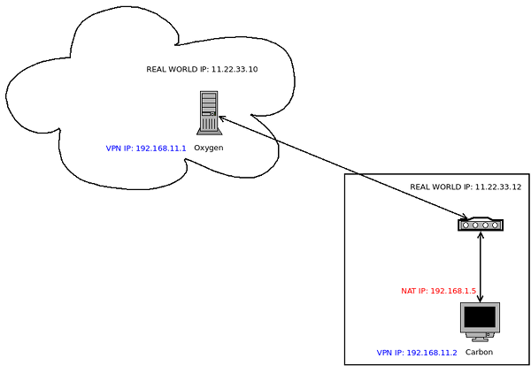

# Setting up Tinc VPN on Linode

---
author:
  name: Linode Community
  email: docs@linode.com
description: 'Tinc server installation and configuration guide.'
keywords: 'VPN, Tinc, Server, Client'
license: '[CC BY-ND 4.0](https://creativecommons.org/licenses/by-nd/4.0)'
published: 'Wednesday, Aug 29th, 2017'
modified: Wednesday, Aug 29th, 2017
modified_by:
  name: Linode
title: 'Setting up Tinc VPN on Linode'
contributor:
  name: Luis Cortés
  link: cscortes @ Github
  external_resources:
- '[Tinc Documentation](https://www.tinc-vpn.org/docs/)'
---

*This is a Linode Community guide. If you're an expert on something we need a guide on, you too can [get paid to write for us](/docs/contribute).*
----

## What is Tinc

According to Tinc's own documentation:

  > tinc is a Virtual Private Network (VPN) daemon that uses tunnelling and encryption to create a secure private network between hosts on the Internet. tinc is Free Software and licensed under the GNU General Public License version 2 or later. Because the VPN appears to the IP level network code as a normal network device, there is no need to adapt any existing software. This allows VPN sites to share information with each other over the Internet without exposing any information to others. 

Of course, to install the latest software version of tinc, one can pull the source code from the [download page](https://www.tinc-vpn.org/download/). The easier way may be provided by your operating system.  For this example we will use Fedora 26 and use the built-in installer to grab the necessary tinc binaries.

Since system administration will be part of this installation referencing 
guides on [Introduction to Linux Concepts](https://www.linode.com/docs/tools-reference/introduction-to-linux-concepts) and
[Linux System Administration Basics](https://www.linode.com/docs/tools-reference/linux-system-administration-basics) might come in handy.

{: .note}
> The steps in this guide require root privileges. Be sure to run the steps below as `root` or with the `sudo` prefix. For more information on privileges, see our [Users and Groups](/docs/tools-reference/linux-users-and-groups) guide.

## Before You Begin

1.  Familiarize yourself with our [Getting Started](/docs/getting-started) guide and complete the steps for setting your Linode's hostname and timezone.  Our Linode system will have a hostname of **oxygen**.

2.  This guide will use `sudo` wherever possible. Complete the sections of our [Securing Your Server](/docs/security/securing-your-server) to create a standard user account, harden SSH access and remove unnecessary network services. Do **not** follow the Configure a Firewall section yet--this guide includes firewall rules specifically for a tinc server.

3.  A client system (laptop or computer) with fedora 26 workstation installed.  Our client system will be called **carbon**

{: .note}
> The real world IP addresses are completely made up.  They are provided to give you a reference for the confiruation files.  Do not use them for your own server or client. 
 
Please replace 11.22.33.10/8 with the real world ip address of your Linode server.  Also, replace 11.22.33.12/8 with the real world ip address of your wireless router.  

{: .note}
> The assumption for your real world IP address for your wireless router is that you have a static IP address.  Otherwise, you need to find out what has been assigned to it by a dhcp server everytime and reconfigure your tinc host file on your Linode server.

##The Target Senario

Our aim is to setup tinc on our linode server in the cloud and then make at least one vpn connection using tinc on a fedora 26 client.  To add a little bit complexity, our client using tinc is behind a wireless router.  The wireless router should be able to obtain a real world ip address from the internet and our client is assigned a NAT address from our wireless router.  This configuration would approximate a real world scenario.

## Server Configuration

### Install Package Dependencies

1.  make sure you are upto date:

        sudo dnf update

        sudo dnf upgrade

2.  Install tinc, only 1 package is needed for server or client:

        sudo dnf install tinc

###  Configuration files for Server

1.  We are going to create the directory all the way down to a netname directory.  Normally, you would pick a netname, and create a directory under your tinc folder with that name.  We will do this all in 1 step.  Assuming that our netname is "myvpn", we create all necessary folders with the following command:

        sudo mkdir -p /etc/tinc/myvpn

2.  There are 2 files that control your vpn interfaces.  For a basic setup, we can use the same instructions from their sample tar file in the tinc share directory.  They are so easy, I will show you how to create them with the cat command:

        sudo cat > /etc/tinc/myvpn/tinc-down 
        #!/bin/sh
        ifconfig $INTERFACE down
        CNTL-Z

        sudo cat > /etc/tinc/myvpn/tinc-up
        #!/bin/sh 
        ifconfig $INTERFACE 192.168.1.1 netmask 255.255.255.0
        CNTL-Z

3. After you have created these files, make sure the permissions are correctly set for execution of these 2 files:

        chmod 755 /etc/tinc/myvpn/tinc-* 

